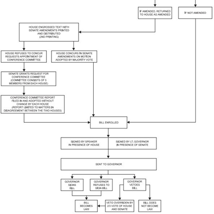

# The Texas Legislature 

## Introduction: The Texas Legislature

### Chapter Learning Objective

By the end of this chapter, you will be able to:

- Outline the function, structure, and responsibilities of the Texas legislature

### Introduction

This chapter examines the Texas State Legislature--the lawmaking branch of Texas government.

### The Texas State Capitol

Figure 3.1 The Texas State Capitol is the capitol building and seat of government of the American state of Texas. Located in downtown Austin, Texas, the structure houses the offices and chambers of the Texas Legislature. Image Credit: LoneStarMike, License: CC- BY-3.0

 
### Licenses and Attributions

CC LICENSED CONTENT, ORIGINAL

Revision and Adaptation. Authored by: Kris S. Seago. License: CC BY: Attribution

Revision and Adaptation: Introduction to the Texas Legislature. Authored by: John Osterman. License: CC BY: Attribution

## The Structure and Function of the Texas Legislature

### Learning Objectives

By the end of this section, you should be able to:

- Describe the function and structure of the Texas legislature

###Introduction

This section examines the structure and functions of the Texas State Legislature.

###Structure

The structure of any institution or organization matters a great deal. The structure can determine how well an institution fulfills its duties and 
responsibilities. Article 3 of the Texas Constitution describes the legislative department (branch) of Texas. Texas Legislature utilizes a 
**bicameral** (two branches or chambers) system with the Texas Senate being the upper house, and the Texas House of Representatives the lower house. 
Every other state has a bicameral legislature except for Nebraska. One of the benefits of a bicameral legislature is the is forces either chamber 
to compromise on legislation before passing it onto the government.

Much like the Framers of the U.S. Consitution, the men who wrote the Texas constitution recognizes the benefit of slowing down the legislative process. Moreover, there are a total of 181 members of the Texas Legislature: 31 Senators, and 150 members of the House. There will be more in the text about them later; however, for now, understand that the different sizes of each chamber also plays a role in how well they function.

Texas uses **single-member districts**, meaning each member of the Texas Legislature represents one legislative district. This is also true of congressional seats. Every ten years, after the U.S. census, the state legislative districts and congressional districts are redrawn to maintain 
**proportional representation**. This is also called reapportionment when it is done at the national level because all 435 seats have to be approximately equal in size. This causes some states to lose or gain seats every ten years based on their changing population.

### Texas State House District Map

Figure 3.2 Texas has 150 state representative districts. Each district has an ideal 2010 census population of 167,637. Image Credit: Texas Redistricting: Current District Plans-State Senate

#### Texas State Senate District Map

Figure 3.3 Texas has 31 state senate districts. Each district has an ideal 2010 census population of 811,147. Image Credit: Texas Redistricting: Current District Plans-State Senate

#### Who Represents Me?

Look on the district maps above, or visit the [Texas Redistricting](https://wrm.capitol.texas.gov/home) website 
to find out the state house and senate representatives who represent you.

### Duties and Roles

The duties of the legislature include consideration of proposed laws and resolutions, consideration of proposed constitutional amendments for submission to the voters, and appropriation of all funds for the operation of state government. All bills for raising revenue considered by the legislature must originate in the house of representatives. The House alone can bring impeachment charges against a statewide officer, which charges must be tried by the senate. All bills for raising revenue considered by the Legislature must originate in the House of Representatives. The House alone can bring impeachment charges against a statewide officer, impeachment charges are tried by the Senate.

The Legislature is the constitutional successor of the Congress of the Republic of Texas after Texas’s 1845 entrance into the Union. The Legislature held its first regular session from February 16 to May 13, 1846.

### Organization and Leadership

Although members are elected on partisan ballots, both houses of the Legislature are officially organized on a nonpartisan basis, with members of both parties serving in leadership positions such as committee chairmanships. As of the 2019 Legislative Session, a majority of the members of each chamber are members of the Republican Party.

The Lieutenant Governor (currently Dan Patrick), elected statewide separately from the governor, presides over the Senate, while the Speaker of the House (currently Dade Phelan from the Beaumont area) is elected from that body by its members. Both have wide latitude in choosing committee membership in their respective houses and have a large impact on lawmaking in the state.

 
### Legislative Sessions

#### Regular Sessions

The Texas Legislature uses **biennial sessions** which means they meet once every odd-numbered years, for 140 days.

The Texas Legislature meets in regular session on the second Tuesday in January of each odd-numbered year. The Texas Constitution limits the regular session to 140 calendar days.

#### Special Sessions

Only the governor may call the legislature into **special sessions**, unlike other states where the legislature may call itself into session. The governor may call as many sessions as he or she desires. For example, Governor Rick Perry called three consecutive sessions to address the 2003 Texas congressional redistricting. The Texas Constitution limits the duration of each special session to 30 days; lawmakers may consider only those issues designated by the governor in his “call,” or proclamation convening the special session (though other issues may be added by the Governor during a session).

### Redistricting

#### What is Redistricting?

Redistricting is the process by which new congressional and state legislative district boundaries are drawn. Each of Texas’ 36 United States Representatives, 31 state senators, and 181 state legislators are elected from political divisions called districts. United States Senators are not elected by districts, but by the states at large. District lines are redrawn every 10 years following completion of the United States census. The federal government stipulates that districts must have nearly equal populations and must not discriminate on the basis of race or ethnicity based on the U.S. Supreme Court case of Reynolds v. Sims (1964).

#### Why does Texas Have to Redistrict?

The federal constitution calls for reapportionment of congressional seats according to population from a decennial census (Section 2, Article I). Reapportionment is the division of a set number of districts among established units of government. For example, the 435 congressional seats are reapportioned among the 50 states after each decennial census according to the method of equal proportions. The boundaries of the congressional districts are then redrawn by state legislatures in accordance with state and federal law.

Redistricting is the revision or replacement of existing districts, resulting in new districts with different geographical boundaries. The basic purpose of decennial redistricting is to equalize population among electoral districts after publication of the United States census indicates an increase or decrease in or shift of population.

The Texas Constitution requires the legislature to redistrict Texas house and senate seats during its first regular session following publication of each United States decennial census (Section 28, Article III). After each census, State Board of Education seats also must be redistricted to bring them into compliance with the one-person, one-vote requirement.

Although the formal redistricting process under the Texas Constitution may remain the same, every decade sees a different, often unpredictable, path for state redistricting plans, depending on legislative, gubernatorial, **Legislative Redistricting Board**, and judicial action. The history of the redistricting process during the 1980s, 1990s, 2000s, and 2010s illustrates some of the different courses decennial redistricting can take. The timing and legal requirements, however, dictate that the basic process generally takes the following course, which is described in more detail in the associated sections.

Federal census population data is delivered to the legislature no later than April 1 of the year following the decennial census, and the data is usually provided several weeks earlier. As soon as the census data is verified and loaded in the computer systems, the members of the legislature and other interested parties begin drawing plans. Bills to enact new state redistricting plans follow the same path through the legislature as other legislation.

If Texas senate or house districts are not enacted during the first regular session following the publication of the decennial census, the Texas Constitution requires that the Legislative Redistricting Board (LRB), a five-member body of state officials including the lieutenant governor and speaker, meet and adopt its own plan. The LRB has jurisdiction only in the months immediately following that regular session.

If congressional or State Board of Education districts are not enacted during the regular session, the governor may call a special session to consider the matter. If the governor does not call a special session, then a state or federal district court likely will issue court-ordered plans. Similarly, if the legislature and LRB fail to adopt a state senate or state house plan, a court will likely issue a plan to fill the void.

A suit challenging an adopted redistricting plan may be brought at any time under the federal or state constitution or federal law. Before 2013, Texas and certain other states were required to obtain federal preclearance of any redistricting plans before they could be implemented. In 2013, the applicable provision of the federal Voting Rights Act was held invalid by the U.S. Supreme Court in Shelby County v. Holder.

The filing deadline for primary elections established by the Texas Election Code allows approximately six and one-half months from the end of the regular legislative session for the governor to act on any redistricting legislation passed, for the LRB to meet if necessary, for any special session called to consider redistricting if necessary, for court action, and for counties to make necessary changes in county election precincts.

#### Controversies

 

There are conflicting opinions regarding the correlation between partisan gerrymandering and electoral competitiveness. In 2012, Jennifer Clark, a political science professor at the University of Houston, said, “The redistricting process has important consequences for voters. In some states, incumbent legislators work together to protect their own seats, which produces less competition in the political system. Voters may feel as though they do not have a meaningful alternative to the incumbent legislator. Legislators who lack competition in their districts have less incentive to adhere to their constituents’ opinions.

Section 2 of the **Voting Rights** Act of 1965 mandates that electoral district lines cannot be drawn in such a manner as to “improperly dilute minorities’ voting power.” No voting qualification or prerequisite to voting, or standard, practice, or procedure shall be imposed or applied by any State or political subdivision to deny or abridge the right of any citizen of the United States to vote on account of race or color.

States and other political subdivisions may create majority-minority districts in order to comply with Section 2 of the Voting Rights Act. A majority-minority district is a district in which minority groups compose a majority of the district’s total population. As of 2015, Texas was home to 18 congressional majority-minority districts.

Proponents of majority-minority districts maintain that these districts are a necessary hindrance to the practice of **cracking**, which occurs when a constituency is divided between several districts in order to prevent it from achieving a majority in any one district. In addition, supporters argue that the drawing of majority-minority districts has resulted in an increased number of minority representatives in state legislatures and Congress.

Critics, meanwhile, contend that the establishment of majority-minority districts can result in **packing**, which occurs when a constituency or voting group is placed within a single district, thereby minimizing its influence in other districts. Because minority groups tend to vote Democratic, critics argue that majority-minority districts ultimately present an unfair advantage to Republicans by consolidating Democratic votes into a smaller number of districts.

### Current District Maps

View current district maps at [Texas Redistricting](https://redistricting.capitol.texas.gov/) website, where you can use the DistrictViewer software.

 
### Senate Elections at the Beginning of a New Decade

Each senator serves a four-year term and one-half of the Senate membership is elected every two years in even-numbered years, with the exception that all the Senate seats are up for election for the first legislature following the decennial census in order to reflect the newly redrawn districts.

After the initial election, the Senate is divided by lot into two classes, with one class having a re-election after two years and the other having a re-election after four years. This process protects the Senate’s membership and the Senate as an institution serving as the more elite legislative chamber during normal (i.e., not at the beginning of new decade) election cycles.

### Licenses and Attributions

CC LICENSED CONTENT, ORIGINAL

Revision and Adaptation. Authored by: Kris S. Seago. License: CC BY: Attribution

Revision and Adaptation: Structure and Function of the Texas Legislature. Authored by: John Osterman. License: CC BY: Attribution

## Qualifications for Service in the Texas Legislature

### Learning Objective

By the end of this section, you will be able to:

- Discuss the qualifications for service in the Texas State Legislature

### Introduction

This section describes the qualifications for service and terms of office for Texas State Legislators.

Figure 3.4 State Senator Carol Alvarado and State Representative Sarah Davis conduct a joint presentation on education reform to a Texas Association of Business meeting in 2019. Image Credit: Andrew Teas License: CC BY

 
### Qualifications for Service in the Legislature

The following are the legal requirements in order for someone to meet the qualifications to become a member of the Texas Legislature.

#### Texas Representative (House)

- U.S. Citizen
- 2 years as a resident of Texas
- 12 months as a resident of their District
- At least 21 years old
- 2 year terms with unlimited terms, no term limit

Figure 3.5 State Representative Barbara Gervin-Hawkins (D-San Antonio) explains a bill to the House Criminal Jurisprudence Committee in April 2019. Image Credit: Andrew Teas License: CC BY

#### Texas Senator

- U.S. Citizen
- 5 years as a resident of Texas
- 12 months as a resident of their District
- At least 26 years old
- 4-year terms with unlimited terms, no term limit

Figure 3.6 Senator Brandon Creighton (R-Woodlands) at a Committee Hearing in 2019. Image Credit: Andrew Teas Image Credit: Andrew Teas License: CC BY

### Licenses and Attributions

CC LICENSED CONTENT, ORIGINAL

Revision and Adaptation. Authored by: Kris S. Seago. License: CC BY: Attribution

Revision and Adaptation: Membership in the Texas Legislature. Authored by: John Osterman. License: CC BY: Attribution

## Demographic Composition of the Texas State Legislature

### Learning Objective

At the end of this section, you will be able to:

- Discuss the demographic composition of the Texas House of Representatives and the Texas Senate

### Introduction

This section describes the demgraphic composition of the Texas House of Representatives and the Texas Senate

### General Description: Pale, Male, and Stale

It’s often been said the Texas State Legislature is “pale, male, and stale.” This may not be quite as accurate as in the past, but the Texas State 
Legislature is predominantly white, male, and middle-aged, making it far less diverse than Texas as a whole.

Descriptive data on the composition of the Texas State Legislature is available at the [Legislative Reference Library](https://lrl.texas.gov/legeLeaders/members/memberStatistics.cfm).

### Partisan Makeup

The Republican Party controls both the Texas State House of Representatives and the Texas State Senate:

The Texas State House of Representatives currently has 83 Republicans and 67 Democrats.

The Texas State Senate currently has 18 Republicans and 13 Democrats.

 
Texas Senate Seats
Figure 3.8 Seat diagram of the Texas Senate as of January 2021 (87th Legislative Session). Image credit: Basil the Bat Lord, License: CC-BY-SA-4.0

 

 
Texas House Seating
Figure 3.9 Seat diagram of the Texas House as of January 2021 (87th Legislative Session). Image Credit: Basil the Bat Lord, License: CC-BY-SA-4.0

 
Gender Makeup

The Texas State Legislature is predominantly male. Although their overall count is growing, women remain incredibly outnumbered in the 87th Texas Legislature— just 48 of 181 seats in the House and Senate are currently held by women.

Approximately 25% of the Texas State House of Representatives is female (112 males, 38 females)

Approximately 32% of the Texas State Senate is female (21 males, 10 females)

Taken together, only 27% of the total membership of the Texas State Legislature is female (48 of 181 total members).

Notably, with the addition of Democrats Julie Johnson, Jessica González, and Erin Zwiener to the 86th Legislature in 2019, the number of legislators who identify as members of the LGBT community increased from two to five.

 
### Age Distribution

| Description | House Members | Senate Members | Total |
| ----- | ----- | ----- | ----- |
| Under 30 | 0 | 0 | 0 |
| 30 - 39 | 16 | 0  | 16 |
| 40 - 49 | 43 | 1 | 44 |
| 50 - 59 | 44 | 15 | 59 |
| 60 - 69 | 29 | 7 | 36 |
| 70 and over | 17 | 8 | 2 |

### Licenses and Attributions

CC LICENSED CONTENT, ORIGINAL

Revision and Adaptation. Authored by: Kris S. Seago. License: CC BY: Attribution

Revision and Adaptation: Composition of Texas Legislature. Authored by: John Osterman. License: CC BY: Attribution

## The Legislative Process

### Learning Objectives

By the end of this section, you will be able to:

- Analyze the Texas legislative process (aka How a Bill Becomes a Law)

###Introduction

This section discusses the Texas legislative process.

### How do Legislators Make Decisions?

The people we elect to be lawmakers determines the rules we have to live by. So, it is good for us to understand what influences the decisions of lawmakers. Unfortunately, we can't know for sure. We would like to believe that whatever they promised on the campaign trail will be what they deliver on in office. That is often not the case. We know that public opinion polls sometimes reflect how lawmakers will decide to vote on issues. We also know that interest groups play a role in how decisions are made. One of the biggest factors is probably political ideology. Is the politician a conservative or a liberal? Or, partisanship might be a factor. Is the politician a Republican or a Democrat? At the end of the day, it is for us to determine whether we believe that politicians are doing the right thing regardless of the influences on their decisions.

### Setting the Stage and Making the Rules

The legislature meets every odd-numbered year to write new laws and to find solutions to the problems facing the state. This meeting time, which begins on the second Tuesday in January and lasts 140 days, is called the regular session. The governor can direct the legislature to meet at other times also. These meetings, called special sessions, can last no more than 30 days and deal only with issues chosen by the governor.

On the first day of each regular session, the 150 members of the House of Representatives choose one of their members to be the Speaker of the House. The speaker is the presiding officer of the House. The Speaker maintains order, recognizes members to speak during debate, and rules on procedural matters.

The Speaker also appoints the chairs and vice chairs of the committees that study legislation and decides which other representatives will serve on those committees, subject to seniority rules. There are 31 committees, each of which deals with a different subject area, and five committees that deal with procedural or administrative matters for the house. Most members serve on two or three different committees.

In the Senate, the presiding officer is the Lieutenant Governor, who is not actually a member of the Senate. The Lieutenant Governor is the second-highest-ranking officer of the executive branch of government and, like the Governor, is chosen for a four-year term by popular vote in a statewide election.

The first thing that the Speaker of the House and the Lieutenant Governor ask their respective chambers to do is to decide on the rules that the legislators will follow during the session. Some legislative procedures are provided for in the state constitution, but additional rules can be adopted by a house of the legislature if approved by a majority vote of its members.

Once rules have been adopted, the legislature begins to consider bills.

### Introducing a Bill

A representative or senator gets an idea for a **bill** by listening to the people he or she represents and then working to solve their problem. A bill may also grow out of the recommendations of an interim committee study conducted when the legislature is not in session. The idea is researched to determine what state law needs to be changed or created to best solve that problem. A bill is then drafted by the legislator, often with the help of an interest group and with legal assistance from the Texas Legislative Council, a legislative agency that provides bill drafting services, research assistance, computer support, and other services for legislators.

Once a bill has been written, it is introduced by a member of the House or Senate in the member’s own chamber. Sometimes, similar bills about a particular issue are introduced in both chambers at the same time by a representative and senator working together. However, any bill increasing taxes or raising money for use by the state must start in the House of Representatives.

Representatives and senators can introduce bills on any subject during the first 60 calendar days of a regular session. After 60 days, the introduction of any bill other than a local bill or a bill related to an emergency declared by the governor requires the consent of at least four-fifths of the members present and voting in the house or four-fifths of the membership in the senate.

After a bill has been introduced, a short description of the bill, called a caption, is read aloud while the chamber is in session so that all of the members are aware of the bill and its subject. This is called the first reading, and it is the point in the process where the presiding officer assigns the bill to a committee. This assignment is announced on the chamber floor during the first reading of the bill.

### The Committee Process

The chair of each committee decides when the committee will meet and which bills will be considered. The House rules permit a House committee or subcommittee to meet: (1) in a public hearing where testimony is heard and where official action may be taken on bills, resolutions, or other matters; (2) in a formal meeting where the members may discuss and take official action without hearing public testimony; or (3) in a work session for discussion of matters before the committee without taking formal action. In the Senate, testimony may be heard and official action may be taken at any meeting of a Senate committee or subcommittee. Public testimony is almost always solicited on bills, allowing citizens the opportunity to present arguments on different sides of an issue.

A House committee or subcommittee holding a public hearing during a legislative session must post notice of the hearing at least five calendar days before the hearing during a regular session and at least 24 hours in advance during a special session. For a formal meeting or a work session, written notice must be posted and sent to each member of the committee two hours in advance of the meeting or an announcement must be filed with the journal clerk and read while the House is in session. A Senate committee or subcommittee must post notice of a meeting at least 24 hours before the meeting.

After considering a bill, a committee may choose to take no action or may issue a report on the bill. The committee report, expressing the committee’s recommendations regarding action on a bill, includes a record of the committee’s vote on the report, the text of the bill as reported by the committee, a detailed bill analysis, and a fiscal note or other impact statement, as necessary. The report is then printed, and a copy is distributed to every member of the house or senate.

In the House, a copy of the committee report is sent to either the Committee on Calendars or the Committee on Local and Consent Calendars for placement on a calendar for consideration by the full house. In the Senate, local and noncontroversial bills are scheduled for senate consideration by the Senate Administration Committee. All other bills in the Senate are placed on the regular order of business for consideration by the full Senate in the order in which the bills were reported from the Senate committee.

At the beginning of each legislative session, a “blocker bill” is placed on the regular order of business. This bill will never be brought to the floor for action. Consequently, unless the sponsor of the bill has talked to the president of the Senate, indicating intent to suspend the rules and bring a bill to the floor, the bill will not be considered. Thus, the president of the Senate maintains a so-called “intent calendar,” which determines the order of business in the Senate. In 2021, the Senate Rules required a vote of 18 members to suspend the rules so that a bill on the intent calendar could be considered on the floor. 

 
### Floor Action Floor Debate

Figure 3.10 State Representative Dan Huberty (R-Kingwood) argues for an
education reform bill on the House floor in 2019. Image Credit: Andrew Teas License: CC BY

When a bill comes up for consideration by the full House or Senate, it receives its second reading. The bill is read, again by caption only, and then debated by the full membership of the chamber. Any member may offer an amendment, but it must be approved by a majority of the members present and voting to be adopted. The members then vote on whether to pass the bill. The bill is then considered by the full body again on the third reading and final passage.

A bill may be amended again on the third reading, but amendments at this stage require a two-thirds majority for adoption. Although the Texas Constitution requires a bill to be read on three separate days in each chamber before it can become law, this constitutional requirement may be suspended by a four-fifths vote of the chamber in which the bill is pending. The Senate routinely suspends this provision in order to give a bill a third reading immediately after its adopted on second reading. The House rarely suspends this provision. However, since the readings are required on three separate legislative days, the House can recess at the end of one calendar day, reconvene the next calendar day, pass a bill on second reading, then adjourn. During the same calendar day, the House can convene a new legislative day, pass the bill on third reading, and the constitutional requirement is met even though the bill was read twice on the same calendar day. This is especially important at the end of the regular legislative session.

### Voting on the Floor

In either chamber, a bill may be passed on a voice vote or a record vote. In the House, record votes are tallied by an electronic vote board controlled by buttons on each member’s desk. In the Senate, record votes are taken by calling the roll of the members.

Figure 3.11 Texas House members cast floor votes electronically from their desks from a panel like this one. Image Credit: Andrew Teas License: CC BY

Figure 3.12 The results of floor votes in the Texas House of Representatives are displayed on this board at the front of the Chamber. While the Speaker is a member of the House and is entitled to cast a vote on any measure, the presiding officer by tradition typically votes "present" as a sign of deferring to the judgment of the House membership. Image Credit: Andrew Teas License: CC BY

If a bill receives a majority vote on third reading, it is considered passed. When a bill is passed in the house where it originated, the bill is engrossed, and a new copy of the bill which incorporates all corrections and amendments is prepared and sent to the opposite chamber for consideration. In the second house, the bill follows basically the same steps it followed in the first house. When the bill is passed in the opposite house, it is returned to the originating chamber with any amendments that have been adopted simply attached to the bill.

### Action on the Other Chamber's Amendments and Conference Committees

The Texas Constitution requires a bill to pass both chambers in identical form. Consequently, if a bill is returned to the originating chamber with amendments, the originating chamber can either agree to the amendments or request a conference committee to work out differences between the House and Senate version. If the amendments are agreed to, the bill is put in final form, signed by the presiding officers, and sent to the governor.

Conference committees are composed of five members from each house appointed by the presiding officers. Once the conference committee reaches agreement, a conference committee report is prepared and must be approved by at least three of the five conferees from each house. Conference committee reports are voted on in each house and must be approved or rejected without amendment. If approved by both chambers, the bill is signed by the presiding officers and sent to the governor.

### Governor’s Action

Upon receiving a bill, the governor has 10 days in which to sign the bill, veto it, or allow it to become law without a signature. If the governor vetoes the bill and the legislature is still in session, the bill is returned to the house in which it originated with an explanation of the governor’s objections. A two-thirds majority in each house is required to override the veto. If the governor neither vetoes nor signs the bill within 10 days, the bill becomes a law. If a bill is sent to the governor within 10 days of final adjournment, the governor has until 20 days after final adjournment to sign the bill, veto it, or allow it to become law without a signature. At this point, the governor’s veto is absolute since the legislature has adjourned, and only the governor can call the legislature back for a special session.

### Enactment (When Laws Go Into Effect)

Any bill passed by the Legislature takes effect 90 days after its passage unless two-thirds of each house votes to give the bill either immediate effect or earlier effect. The Legislature may provide for an effective date that is after the 90th day. Under current legislative practice, most bills are given an effective date of September 1 in odd-numbered years (September 1 is the start of the state’s fiscal year).

### Basic Steps in the Texas Legislative Process (Diagram)

Figure 3.13 This diagram displays the sequential flow of a bill from the time it is introduced in the Texas House of Representatives for final passage and transmittal to the Governor. A bill that is introduced at the Senate would follow the same procedures in reverse. Image Credit: Public Domain.

 
### Constitutional Amendments

Proposed amendments to the Texas Constitution are in the form of joint resolutions instead of bills and require a vote of two-thirds of the entire membership in each house for adoption. Joint resolutions are not sent to the governor for approval, but are filed directly with the secretary of state. A joint resolution proposing an amendment to the Texas Constitution does not become effective until it is approved by a simple majority of Texas voters in a general election.

### Link to Learning

Want to Get Involved?

Check out the [[Citizen Handbook]](https://senate.texas.gov/_assets/pdf/Citizen_HBook_Web_2015.pdf) 
the Secretary of the Senate, which includes information on the legislative process in Texas, advocacy etiquette, and 
guidelines.

The Texas Legislative Council has provided a detailed description of the [legislative process in Texas](https://tlc.texas.gov/docs/legref/legislativeprocess.pdf).

You may research past and current legislation at the [Texas Legislature Online](https://capitol.texas.gov/Home.aspx).

### Licensing and Attribution

CC LICENSED CONTENT, ORIGINAL

Revision and Adaptation. Authored by: Kris S. Seago. License: CC BY: Attribution

PUBLIC DOMAIN CONTENT

How a Bill Becomes a Law. Authored by: Texas House of Representatives. Located at: https://house.texas.gov/about-us/bill/ License: Public Domain: No Known

## Compensation, Privileges, and Immunities

### Learning Objectives

By the end of this section, you will be able to:

- Discuss the basic compensation, privileges, and immunities of Texas legislators

### Introduction

This section describes the basic compensation, privileges, and immunities of Texas legislators

### Compensation

#### Salary

State legislators in Texas make $600 per month or $7,200 per year, plus a per diem set by the Ethics Commission in Rule 50.1. The per diem in the 
2021-2022 biennium was $221 for every day the Legislature is in session (regular or special). This adds up to a total of $38,140 in a year with a 
regular session ($7200 salary plus $30,940 per diem), and a two-year term paying a total of $45,340 ($14,400 salary plus $30,940 per diem).

#### Retirement Options

Legislators receive a pension after eight years of service, starting at age 60. A legislator’s pension is based not on a legislator’s salary of 
$600 a month, but on the current salary of a Texas state district court judge—a base salary of $140,000 per year.

### Legislative Immunities

The Texas Constitution grants two types of immunities to Texas state legislators. One protects speech and debate. The other prevents or limits 
arrest during the legislative session.

###Speech and Debate Immunities

The Texas Constitution (Article III, Section 21) grants Texas state legislators a fundamental protection of free speech and debate. This immunity protects legislators from punitive executive or judicial action. The intent is to allow lawmakers to work independently and unimpeded by the threat of intervention from the other branches of government in the discharge of their legislative duties.

### Arrest Immunities

Texas state legislators are also protected from arrest traveling to and from and during legislative sessions. Exceptions include treason, felony, 
or breach of the peace.

### Licenses and Attributions

CC LICENSED CONTENT, ORIGINAL

Revision and Adaptation. Authored by: Kris S. Seago. License: CC BY: Attribution

### Glossary

**biennial sessions**: In Texas, legislative sessions meet once every odd-numbered years, for 140 days

**bill**: a proposed law that has been sponsored by a member of the legislature and submitted to the clerk of the House or Senate

**cracking**: occurs when a constituency is divided between several districts in order to                    prevent it from achieving a majority in any one district.

**gerrymandering**: the process in which voting districts are redrawn in a way to favor one party during elections

**legislative budget**: the state budget that is prepared and submitted by the Legislative Budget Board (LBB) and that is fully considered by the House and Senate

**packing**: occurs when a constituency or voting group is placed within a single district, thereby minimizing its influence in other districts.

**redistricting**: the process of redrawing election districts and redistributing legislative representatives in the Texas House, Texas Senate, and U.S. House. Redistricting typically occurs every 10 years to reflect shifts in population or in response to legal challenges in existing districts

**single-member district**: a district in which one official is elected rather than multiple officials.

**special session**: a legislative session called by the governor that addresses an agenda set by him or her; lasts no longer than 30 days

**Voting Rights Act of 1965**: mandates that electoral district lines cannot be drawn in such a manner as to “improperly dilute minorities’ voting power”

### License and Attribution

CC LICENSED CONTENT, ORIGINAL

The Texas Legislature: Glossary. Authored by: John Osterman. License: CC BY: Attribution

## Assessment

Check your knowledge of this Chapter by taking the optional ungraded quiz linked below.

[Optional Ungraded Practice Chapter Quiz](https://docs.google.com/forms/d/1xVUB4ckrvq01LMiMPimVM-Wq6BydkRhmN_PpDDqZs2A/edit?usp=sharing)

