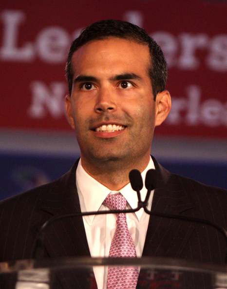

+++
title = 'Module 7 The Executive Branch'
date = 2024-04-03T10:14:27-04:00
+++

# The Executive Department and the Office of the Governor of Texas

## Introduction: Texas' Governor and Executive Branch
Overview

Introduction: Texas' Governor and Executive Branch
Learning Objective

By the end of this chapter, you will be able to:

- Explain the structure and function of the executive branch of the Texas government

Introduction

In its 2019 session, the Texas Legislature failed to pass a “Sunset” bill that would have continued the existence of the Texas State Board of Plumbing Examiners. The bill had stalled amid controversy over whether or not to phase out this small agency and combine its functions into the larger Texas Department of Licensing and Regulation.

Without passage of S.B. 621, Texas faced an interesting problem. With no law requiring plumbers to be licensed and no agency to license them, anybody with a pipe wrench could now go into the plumbing business, performing jobs from replacing a kitchen faucet to complex medical gas piping in a hospital with no license and no training.

Shortly after the session, legislators realized what they had done. Some legislators, plumbers, city plumbing inspectors and others began calling for a special legislative session to fix the problem. Instead, Texas Governor Greg Abbott simply issued an executive order extending the existence of the state board through the next regular legislative session.

How?

"A qualified workforce of licensed plumbers throughout the state, including from areas not directly affected by Hurricane Harvey, will be essential as those funds are being invested in crucial infrastructure, medical facilities, living facilities, and other construction projects,” he said in his order. By extending the board through the next legislative session or until “disaster needs subside,” the governor was able to tap into sweeping powers given to his office to deal with natural disasters.

How can a governor in a “weak governor” state sidestep the legislature and resurrect an agency despite legislation to the contrary? In this chapter, we’ll look at the executive branch of state government in Texas.
Licensing and Attribution

CC LICENSED CONTENT, ORIGINAL

The Executive Department and the Office of the Governor of Texas: Introduction. Authored by: Andrew Teas. License: CC BY: Attribution

## Background

### Learning Objective

At the end of this section, you will be able to:

- Discuss the background of Texas' executive branch and Governor

### Introduction

This section discusses the background of Texas' executive branch.

Figure 4.1 Seal of the Governor. Image Credit: Public Domain.

The executive branch consists of the Governor, Lieutenant Governor, Comptroller of Public Accounts, Land Commissioner, Attorney General, 
Agriculture Commissioner, the three-member Texas Railroad Commission, the State Board of Education, and the Secretary of State. Texas has a 
[plural 
executive] branch system which limits the power of the Governor. Except for the Secretary of State, all executive officers are elected independently 
making them directly answerable to the public, not the Governor.

Partly because of many elected officials, the governor’s powers are quite limited in comparison to other state governors or the U.S. President. In popular lore and belief the lieutenant governor, who heads the Senate and appoints its committees, has more power than the governor. The governor commands the state militia and can veto bills passed by the Legislature and call special sessions of the Legislature (this power is exclusive to the governor and can be exercised as often as desired). The governor also appoints members of various executive boards and fills judicial vacancies between elections. All members of the executive branch are elected statewide except for the Secretary of State (appointed) and the State Board of Education (each of its 15 members are elected from single-member districts).

### History and Background

The state’s first constitution in 1845 established the office of governor, to serve for two years, but no more than four years out of every six (essentially a limit of no more than two consecutive terms). The 1861 secessionist constitution set the term start date at the first Monday in the November following the election. The 1866 constitution, adopted just after the American Civil War, increased terms to 4 years, but no more than 8 years out of every 12, and moved the start date to the first Thursday after the organization of the legislature, or “as soon thereafter as practicable.” The Reconstruction constitution of 1869 removed the limit on terms, Texas remains one of 14 states with no gubernatorial term limit. The present constitution of 1876 shortened terms back to two years, but a 1972 amendment increased it again to four years.

The Texas Constitution specifies that the governor must be at least 30 years old, an American citizen and a resident of Texas for at least five years. Texas governors served two-year terms until voters changed the Constitution to provide for four-year terms in 1972.

The first governor of Texas was J. Pinkney Henderson, who took over executive leadership from the final president of the Republic of Texas, Anson Jones, in 1846. Every governor from Richard Coke (1874–1876) to Dolph Briscoe (1973-1979) was a Democrat. Since George W. Bush’s election to the governor’s office in 1994, all four Texas governors have been Republicans.

Texas was the first southern state to elect a female governor. Miriam Ferguson served two terms following the impeachment of her husband, James Ferguson, in 1917 – the only Texas governor ever impeached. The second female governor, Ann Richards, served in the 1990s.

The Texas governor currently receives a $150,000 annual salary, as well as living accommodations. The Texas Governor’s Mansion, immediately southwest of the Texas Capitol building, has been home to Texas governors and their families since 1856.

### Gubernatorial Elections

Texas elects governors in the midterm elections, that is, even years that are not presidential election years. For Texas, 2022, 2026, 2030 and 2034 are all gubernatorial election years. Legally, the gubernatorial inauguration is always set for the “on the first Tuesday after the organization of the Legislature, or as soon thereafter as practicable.”If two candidates tie for the most votes or if an election is contested, a joint session of the legislature shall cast ballots to resolve the issue.

The incumbent, Greg Abbott, is the forty-eighth governor to serve in the office since Texas' statehood in 1845. He assumed office on January 20, 2015, succeeding Rick Perry (R). Perry was the longest-serving governor in state history with a tenure lasting from 2000 to 2015. Abbott previously served as the Attorney General of Texas from 2002 to 2015.

Figure 4.2 Greg Abbott is an American attorney and politician who has served as the 48th Governor of Texas since January 20, 2015. A Republican, Abbott previously served as the 50th Attorney General of Texas from 2002 to 2015.
Image Credit: Andrew Teas, License: CC BY: Attribution

### Licenses and Attributions

CC LICENSED CONTENT, ORIGINAL

Revision and Adaptation. Authored by: Kris S. Seago. License: CC BY: Attribution

The Executive Powers of the Governor: Revision and Adaptation. Authored by: Andrew Teas. License: CC BY: Attribution

## The Qualifications and Roles of the Texas Governor

### Learning Objectives

By the end of this section, you will be able to:

- Define the qualifications, roles, responsibilities, powers, and procedures associated with the office of the governor of Texas

### Introduction

This section discusses the qualifications, roles, responsibilities, powers, and procedures associated with the office of the Governor of Texas
Qualifications

[Article IV](https://oercommons.org/courseware/lesson/66280/Article%204), Section 4 of the Texas Constitution sets the following qualifications for Governor:

- Must be at least 30 years old;
- Resident of Texas for at least 5 years immediately before the election;
- Must be a U.S. citizen.

### The Roles Played by Texas’ Governor

#### General Roles

The governor makes policy recommendations that lawmakers in both the state House and Senate chambers may sponsor and introduce as bills. The governor also appoints the Secretary of State, as well as members of boards and commissions who oversee the heads of state agencies and departments. As the state's chief budget officer, governors submit an executive budget to the legislature as a plan for revenue and expenditure for the next biennium.
The constitutional and statutory duties of the Governor include

- Signing or vetoing bills passed by the Legislature.
- Serving as commander-in-chief of the state’s military forces.
- Convening special sessions of the Legislature for specific purposes.
- Delivering a report on the condition of the state to the Legislature at the beginning of each regular session.
- Estimating of the amounts of money required to be raised by taxation.
- Accounting for all public monies received and paid out by the Governor and recommending a budget for the next two years.
- Granting reprieves and commutations of punishment and pardons upon the recommendation of the Board of Pardons and Paroles and revoking conditional pardons.
- Declaring special elections to fill vacancies in certain elected offices.
- Appointing qualified Texans to state offices that carry out the laws and direct the policies of state government. Some of these offices are filled by appointment only. Others are ordinarily elected by the people, but the governor must occasionally appoint individuals to fill vacancies. The governor also appoints Texans to a wide range of advisory bodies and task forces that assist him with specific issues.

### Veto Power

The governor has the power to either approve or veto bills passed by the Texas Legislature. The Governor has **line-item veto** power, enabling the governor to **veto** individual components (or lines) of a bill. The Governor of Texas’ line-item veto power applies only to spending measures, only to a bill that “contains several items of appropriation.” When a bill contains several items of appropriation, the Governor “may object to one or more of such items, and approve the other portion of the bill.” Ibid. Thus, the Governor may line-item veto one or more “items of appropriation” without vetoing the entire appropriations bill.

#### Time to Consider

The governor must sign or veto legislation within 10 days of transmittal (excluding Sunday), or it becomes law **without** his or her signature. There 
is no “pocket veto” for the Governor of Texas. For legislation transmitted with less than 10 days left in the session, the governor has 20 days 
**after** adjournment to act, or the legislation becomes law without being signed. This latter provision allows a Governor to veto legislation after 
the Legislature has adjourned, with no opportunity for the Legislature to override a veto. In practice, a Governor’s vetoes are rarely challenged.

#### Legislative Override

Two-thirds of members present in both chambers must vote to override a veto. If all members are in attendance, this is 100 of the 150 members in the Texas House of Representatives and 21 of the 31 members in the Texas State Senate. Texas is one of 36 states that requires a two-thirds vote from both of its legislative chambers to override a veto.

### Clemency Power

The governor has the authority to grant clemency upon the written recommendation of a majority of the [Board of Pardons and 
Paroles](https://www.tdcj.texas.gov/bpp/).

**Clemency** includes full pardons after conviction or successful completion of a term of deferred adjudication community supervision, conditional 
pardons, pardons based on innocence, commutations of sentence, and reprieves. In capital cases, clemency includes commutation of sentence to life 
in prison and a reprieve for execution. The governor may also grant a one-time reprieve of execution, not to exceed (30) days, without a Board 
recommendation.

### Appointment Power

The authority to make governmental **appointments** is one of the most significant powers given to the governor of Texas by the state’s Constitution.

During a four-year term, the Governor will make about 3,000 appointments.

Most appointments are:

- State officials and members of state boards, commissions and councils that carry out the laws and direct the policies of state government activities;
- Members of task forces that advise the Governor or executive agencies on specific issues and policies; or
- State elected and judicial offices when vacancies occur by resignation or death of the office holder.

The majority of these appointments are volunteer positions, representative of our citizen government. Most appointees are entitled to standard travel expenses and/or per diem to attend meetings and conduct business of the board or commission.

 
### Budgetary Power

The Governor has relatively limited budgetary powers. The Governor is required to submit an **executive budget**, but the Legislature typically ignores the Governor’s budget, preferring to take the lead itself on budgetary matters.

A Governor may attempt to influence the budgetary process through the power of persuasion, but this power is limited.

In the end, a Governor’s primary budget power is the power to veto or threaten to veto legislation.

Get to know Texas Governor Greg Abbott (https://gov.texas.gov/governor-abbott), the 48th Governor of the State of Texas.

### Licenses and Attribution

CC LICENSED CONTENT, ORIGINAL

Revision and Adaptation: Authored by: Kris S. Seago. License: CC BY: Attribution

CC LICENSED CONTENT, ADAPTATION

Revision and Adaptation: Qualifications and Roles of the Texas Governor. Authored by: Andrew Teas. License: CC BY: Attribution

PUBLIC DOMAIN CONTENT

Duties, Requirements & Powers. Authored by: Office of the Texas Governor. Located at: https://gov.texas.gov/governor- abbott/duties License: Public Domain: No Known Copyright

 
## The Interplay Between the Legislature and Executive

### Learning Objective

By the end of this section, you will be able to:

- Compare and contrast the powers of the legislative and executive branches of government

### Introduction

This section describes the various roles played by the Legislative and Executive branches in governing Texas.

### Roles Played by the Legislative and Executive Branches

The executive and legislative branches of government play an interesting tug- of-war with public policy in Texas in a slightly different way than 
in the federal government. The Texas Legislature has much more initial control over the budget process than the governor. The **Legislative Budget 
Board (LBB)**, in which the governor plays no part, is an entirely legislative agency, and prepares the state’s draft budget under the direction of 
legislative leaders. This legislature-driven budget, however, starts from a number generated by a different member of the executive branch – the 
Comptroller of Public Accounts.

 The Comptroller’s BRE (biennial revenue estimate) is the initial estimate of what  the state’s total revenue will be over the two-year budget cycle and is a  preview of the number the Comptroller will use at the end of the legislative session to “certify” the budget. Without certification by the Comptroller, the state budget cannot take effect, and legislators would be required to start over. At the end of the session, however, the governor’s office experiences a power surge seen in no other state. A governor can veto most bills after the legislature has finally adjourned, removing the threat of an override. The governor also has “line-item veto” authority, allowing him to veto individual spending items from the state budget without vetoing the entire bill. As with other vetoes – his line-item vetoes can be made after the legislative session has ended.

While the legislature has the sole power to make law in Texas, executive branch agencies have significant latitude to interpret state statutes through agency rulemaking. Legislators, aware and and somewhat wary of this, require a special statement attached to the official analysis of every bill considered on the floor of the House or Senate disclosing whether the bill delegates any rulemaking authority to any state official or agency.

The Texas Attorney General also brings some interpretive power to the equation. With the power to issue a formal Attorney General’s Opinion, this official can sometimes make public policy decisions separately from the legislature, and without the judicial branch. An Attorney General’s Opinion in Texas has the force of law until a court rules otherwise, or the legislature changes the law on which the opinion is based.

### Licenses and Attributions

CC LICENSED CONTENT, ORIGINAL

The Legislative and Executive Branches. Authored by: Andrew Teas. License: CC BY: Attribution

## The Informal Powers of the Executive Branch

### Learning Objective

By the end of this section, you will be able to:

- Discuss the informal powers of the executive branch

### Introduction

A Governor's powers are not limited to their constitutional and statutory authority. This section discusses a Governor's informal powers.

### The Informal Powers of the Executive Branch

In addition to the formal powers of the governor and other executive branch officials, a smart governor can accomplish a lot using informal powers. Governor George W. Bush was legendary for his ability to forge genuine friendships with other state officials – notably House Speaker Pete Laney and Lieutenant Governor Bob Bullock. The three had breakfast at the Governor’s Mansion weekly during legislative sessions. When he announced his candidacy for the Republican nomination for President in 1999, Speaker Laney, a Democrat, introduced him. Friendly late night meetings over a beer or two helped Governor Bush and some of his staunchest political opponents find common ground on a variety of policy issues.

The Texas Governor has the highest-profile role of any state official and can use that to his advantage. An endorsement from a governor can mean a lot in a race for the state house or senate, and a grateful legislator should be eager to return the favor. Conversely, Governor Greg Abbott actively worked against the reelection of two legislators from his own party in 2018 – helping to defeat one.

The governor's appointment power to appoint members to boards, commissions, councils, and committees can provide the governor with significant informal power over policy in many key areas. The executive branch of the Texas government is made up of over 400 state boards, commissions, and agencies. Finally, the governor’s unilateral post-session veto power creates a lot of informal leverage during the legislative session. A legislative bill author asked by the governor to support a change to his bill – even a drastic one – has little alternative, knowing the bill can be vetoed with no opportunity for an override vote.

### Licensing and Attribution

CC LICENSED CONTENT, ORIGINAL

The Informal Powers of the Executive Branch. Authored by: Andrew Teas. License: CC BY: Attribution

## The Plural Executive

### Learning Objective

By the end of this section, you will be able to:

- Explain Texas’ plural executive and discuss the various offices and powers

### Introduction

Texas fragmented the Governor's power at the end of Reconstruction and dispersed executive power by creating a plural executive. This section discusses Texas' plural executive.

### Texas' Plural Executive

[Article 4](https://statutes.capitol.texas.gov/Docs/CN/htm/CN.4.htm) of the Texas Constitution describes the executive department (branch) of 
Texas. Texas utilizes a **plural executive** which means the power of the Governor is limited and distributed amongst other government officials. In 
other words, there is not one government official in Texas that is solely responsible for the Texas Executive Branch.

The state **bureaucracy** in Texas has numerous state boards, commissions, councils, and committees. Additionally, several major agencies within the 
plural executive have administrative and advisory functions.

Below are some of the members of the Texas Plural Executive and their roles:

The **lieutenant governor** is technically a member of the executive branch, but with duties that are mostly legislative. While not a member of the Senate, he serves as the state senate's presiding 
officer - not in a ceremonial role such as that served by the United States Vice President over the U.S. Senate, but as the state senate's day-to-day leader. He is also first in line of succession for 
Governor, member of the Legislative Redistricting Board and Chair of the Legislative Budget Board. He is elected statewide and serves a four-year term. The current lieutenant governor is Dan Patrick, a 
former state senator, and former television sports anchor from Houston.

The **Texas Attorney General** serves at the official lawyer for the State of Texas representing the state on civil matters and is responsible for interpreting the application of statutory law in the 
absence of an applicable court ruling. His office has additional duties relating to child support enforcement and consumer protection. Elected to a four-year term statewide, the current attorney general 
is Ken Paxton, a former state senator from the Dallas area.

The **Commissioner of the General Land Office** is the state's real estate asset manager - an unusual position for voters to choose in a statewide election until you remember that Texas, as a condition of 
admission to the United States in 1845, maintained state ownership of vast amounts of public land that would have become federal in most other states. The leasing of public land for everything from oil 
exploration and mineral leases to grazing has been an important source of funding for state universities and public schools. The land commissioner is also responsible for Texas' 367 miles of Gulf Coast 
beach and has played an increasingly central role in managing disaster relief funds since Hurricane Harvey in 2017. Elected to a four-year term, the current commissioner is George P. Bush, nephew of 
former President George H. W. Bush.

Figure 4.3 George P. Bush at the Republican Leadership Conference in New Orleans, Louisiana. George Prescott Bush is an American corporate lawyer, former U.S. Navy Reserve officer, real estate investor, and politician who serves as the Commissioner of the Texas General Land Office. Public Domain.

The **Comptroller of Public Accounts** is the state's independently-elected chief financial officer. Even if passed by the legislature and signed by the governor, the state's biennial budget cannot take effect unless "certified" by the Comptroller - his official finding that the budgeted amount will not exceed the amount of revenue he believes the state will collect during the budget period. The Comptroller is also the state's tax collector and banker. Glenn Hegar, a former state representative and senator from Katy, is the current Comptroller.

The **Texas Agriculture Commissioner** is elected to both promote and regulate Texas agriculture, which some perceive as a potential conflict. He administers the Texas Agriculture Department, the duties of which include weights and measures - including gasoline. Inspectors check every gas pump in Texas periodically to make sure consumers are receiving the amount they purchase. The current Agriculture Commissioner is Sid Miller, a former state representative from Stephenville.

The **Texas Railroad Commission** consists of three commissioners, all elected statewide, who serve staggered six-year terms. Originally created to regulate intrastate rail commerce, that task was largely assumed by the   federal government, leaving the Commission to take on other tasks. During   the Great Depression, the Commission was given the responsibility of regulating the Texas oil industry, which was a substantial percentage of the world's oil industry in the early Twentieth Century. By setting an "allowable" for every oil well in Texas - the maximum amount that could be legally extracted - the Texas Railroad Commission basically set the global price of oil for many years. The Organization of Petroleum Exporting Countries (OPEC) used the Texas Railroad Commission as their model for creating a worldwide oil cartel  in 1960. The commission still has some authority over gas utilities, pipeline safety, liquified natural gas production, surface coal, and uranium mining.

The **Texas State Board of Education** is the largest elected body in the state's executive branch, with 15 members elected from single-member districts. Chaired by Donna Bahorich, of Houston, the Board is charged with setting curriculum standards, reviewing textbooks, establishing graduation requirements, overseeing the Texas Permanent School Fund, and approving new charter schools. The Board works with the Texas Education Agency, which is administered by a Commissioner of Education appointed by the governor, not the Board. The current Commissioner of Education is Mike Morath, a software developer who served on the Dallas Independent School District Board before his appointment by Governor Greg Abbott in 2016.

The **Texas Secretary of State** is not elected but is appointed by the governor and confirmed by the state senate. The Secretary of State has a variety of duties, including administration of elections 
within Texas, publishing the Texas Register (which notifies the public of proposed and final state agency rules), and advising the governor on border matters and Mexican affairs. The Secretary of State 
also presides over the Texas House of Representatives at the beginning of each legislative session, presiding over the election of his replacement to serve as Speaker of the House.

Governor Abbott appointed John Scott — a Fort Worth attorney who briefly represented former President Donald Trump in a lawsuit challenging the 2020 election results in Pennsylvania — as Texas' new secretary of state on October 21, 2021. 

Abbott announced Scott’s appointment two days after the end of the third special legislative session. That means the Senate will not have to confirm him until the next time it meets, which is currently scheduled for January 2023.

Figure 4.4 On August 19, 2019, Governor Greg Abbott appointed Ruth Ruggero Hughs as the Texas Secretary of State. Ruth Ruggero Hughs of Austin has served as Chair of the Texas Workforce Commission since August 2018, she was first appointed in July 2015. She is a member of the State Bar of Texas and the New Jersey State Bar and chair of the Advisory Council on Cultural Affairs. Hughs received a Bachelor of Arts from The University of Texas at Austin and a Juris Doctor degree from Rutgers Camden School of Law, and she earned a certificate in Leader Development at the U.S. Army War College’s National Security Seminar in 2018. Image credit: @GovAbbott Twitter

Other executive branch officials include hundreds of appointees to state  boards and commissions from the powerful to the obscure. The Texas Transportation Commission oversees billions in highway funding, while the Board of Criminal Justice oversees one of the nations’ largest prison systems. Texas also has a state poet laureate, a state musician and two-state artists – one for two-dimensional and one for three-dimensional media.

 
### Licenses and Attributions

CC LICENSED CONTENT, ORIGINAL

The Texas Plural Executive. Authored by: Daniel M. Regalado. License: CC BY: Attribution

CC LICENSED CONTENT, ADAPTATION

The Texas Plural Executive: Revision and Adaptation. Authored by: Andrew Teas. License: CC BY: Attribution

## Glossary

**appointment**: the power of the chief executive, whether the president of the United States or the governor of the state, to appoint persons to office.

**attorney general**: an elected state official that serves as the state's chief civil lawyer

**bureaucracy**: the complex structure of offices, tasks, rules, and principles of organization that is employed by all large-scale institutions to coordinate the work of their personnel.

**comptroller**: an elected state official who directs the collection of taxes and other revenues, and estimates revenues for the budgeting process.

**executive budget**: the state budget prepared and submitted by the governor of the legislature, which indicates the governor's spending priorities.

**land commissioner**: an elected state official that acts as the manager of the most publicly-owned lands.

**lieutenant governor**: the second-highest elected official in the state and president of the state senate

**line-item veto power**: enables the governor to veto individual components (or lines) of an appropriations bill.

**plural executive**: a group of officers or major officials that functions in making current decisions or in giving routine orders typically the responsibility of an individual executive officer or official. In Texas, the power of the Governor is limited and distributed amongst other government officials.

**secretary of state**: the state official, appointed by the governor, whose primary responsibility is administering elections

**veto**: the governor's power to turn down legislation; can be overridden by a two-thirds vote of both the House and Senate

### Licenses and Attributions

CC LICENSED CONTENT, ORIGINAL

The Executive Department and the Office of the Governor of Texas: Glossary Authored by: Andrew Teas. License: CC BY: Attribution

## Assessment

Check your knowledge of Chapter Seven by taking the optional ungraded quiz linked below. 

[Optional Ungraded Chapter Seven Quiz](https://docs.google.com/forms/d/10dbFGSsW5BDccjLAA_oRBwUUjY88OmgsVytnyjRVNAg/edit?usp=sharing)

